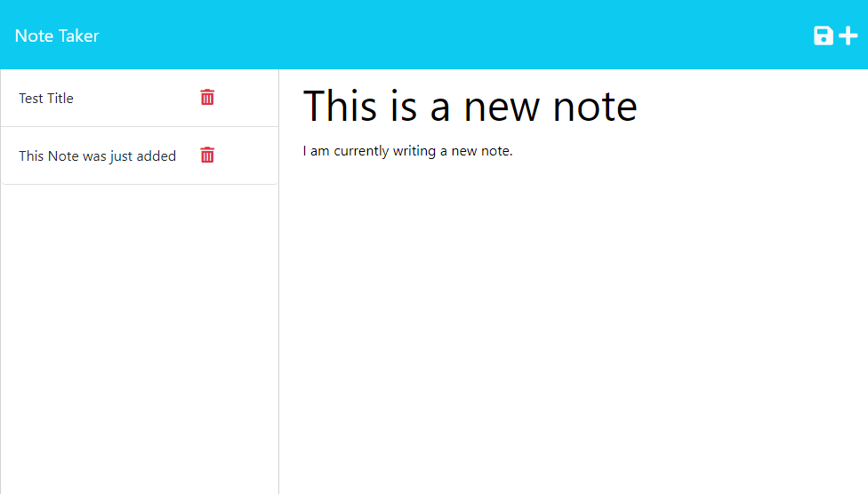

# Note Taker Starter Code

## Description

The Note Taker application is a simple, user-friendly tool for taking and managing your notes. It provides a streamlined way to create, view, and delete notes, helping you stay organized and productive.

## Installation

To use the SVG Logo Maker, follow these steps:

1. Clone this repository to your local machine:
```
git clone git@github.com:ademonteverde/note_taker.git
```

2. Navigate to the project directory:

```
cd note_taker
```

3. Install the required dependencies:
```
npm install
```

4. Run the application:
```
node start
```

5. Open your web browser and access the application at **[http://localhost:3000](http://localhost:3000/)**.

## Usage
Once the application is running, you will be prompted with the following features:

- **Landing Page:** When you open the Note Taker application, you will be presented with a landing page that features a link to a notes page.

- **Notes Page:** On the notes page, you will see existing notes listed in the left-hand column. In the right-hand column, you will find empty fields to enter a new note title and the note's text.

- **Creating a New Note:** Enter a new note title and the note's text in the provided fields. As you start typing, a Save icon will appear in the navigation at the top of the page. Click on the Save icon to save the new note.

- **Viewing Existing Notes:** Click on an existing note in the list to view its details in the right-hand column.

- **Writing a New Note:** In the navigation at the top of the page, click on the Write icon. You will be presented with empty fields to enter a new note title and the note's text in the right-hand column.

## Assets
The following image demonstrates the web application's appearance and functionality:




## Link to GitHub Repository:

[https://github.com/ademonteverde/note_taker](https://github.com/ademonteverde/note_taker)

## Link to deployed application:

[https://ademonteverde.github.io/note_taker/](https://ademonteverde.github.io/note_taker/)

## License

This project is licensed under the [MIT](https://github.com/ademonteverde/note_taker/blob/main/LICENSE) License.


